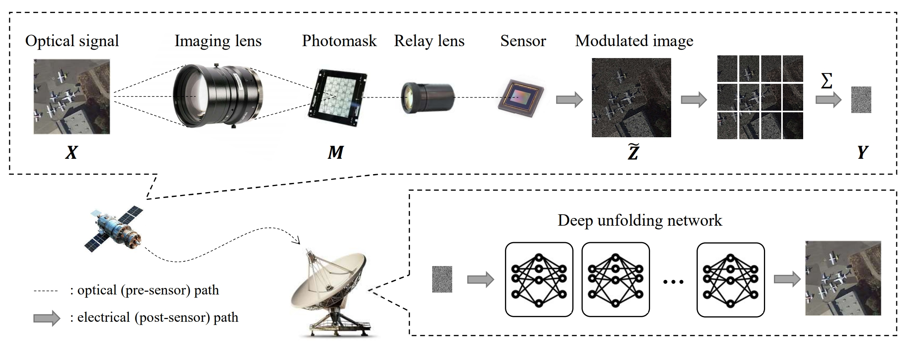
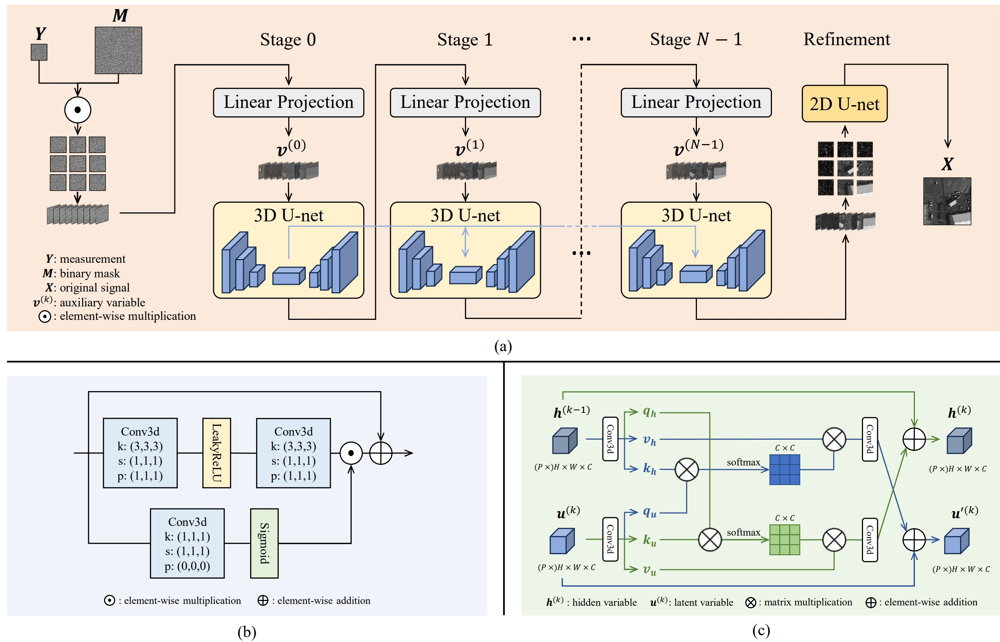

# Ultra-Low Complexity On-Orbit Compression for Remote Sensing Imagery via Block Modulated Imaging
Zhibin Wang, Yanxin Cai, Jiayi Zhou, Yangming Zhang, Tianyu Li, Wei Li, Xun Liu, Guoqing Wang, and Yang Yang

[](https://arxiv.org/abs/2412.18417)


## Encoding Framework


Figure 1: Satellite-side optical encoding for compression and ground-based deep unfolding decoding for reconstruction.

## Decoding Framework


Figure 2: (a) BMNet processes the measurement $Y$ alongside the mask $M$, and reconstructs the original signal $X$. $\textbf{\emph{v}}^{(k)}$ denotes the auxiliary variable at the $k$-th stage (see Eq. 5). (b) The proposed gated 3D convolution block. (c) The proposed Two-Way Cross-Attention module.  $\textbf{\emph{u}}^{(k)}$ denotes the latent variable generated by the encoder of the $k$-th 3D U-net. $\textbf{\emph{h}}_{h}^{(k)}$ denotes the hidden variable of the $k$-th stage ($\textbf{\emph{h}}^{(0)}=\textbf{\emph{u}}^{(0)}$).

## Datasets
<table>
    <thead>
        <tr>
            <th>Dataset</th>
            <th>Train</th>
            <th>Val</th>
        </tr>
    </thead>
    <tbody>
        <tr>
            <td>DOTA-v1.0</td>
            <td><a href="https://pan.baidu.com/s/1WR8CfBlG7lVlexVKkeYBDA?pwd=izw7">Baidu</a></td>
            <td><a href="https://pan.baidu.com/s/1Y3SXLfyJsrPaKl8RkWq8MA?pwd=csts">Baidu</a></td>
        </tr>
        <tr>
            <td>LandSat-8</td>
            <td>-</td>
            <td><a href="https://pan.baidu.com/s/10hODPzK__8aTA4PHAPmxbg?pwd=x9xa">Baidu</a></td>
        </tr>
    </tbody>
</table>

## Training and Evaluation
### Demo
To test the pre-trained BMNet at a compression ratio of [16](https://pan.baidu.com/s/1DLOvUp-uMy2IqsyOeqOAlQ?pwd=y0dy):
```
python eval.py --image_size 512 512 --cs_ratio 4 4 --data_path ./samples --model_path ./model_best.pth --num_shows 1 --results_path ./results/
```

### Training
To train BMNet with 4 GPUs at a compression ratio of 16:
```
CUDA_VISIBLE_DEVICES=0,1,2,3 python -m torch.distributed.launch --master_port 4566 --nproc_per_node=4 train.py --batch_size 4 --learning_rate 5e-6 --image_size 512 512 --num_stage 10 --cs_ratio 4 4 --warmup_steps 5 --opt-level O1 --end_epoch 100 --data_path /data2/wangzhibin/DOTA/trainsplit512_nogap/images/ --save_dir ./model_ckpt/
```

### Evaluation
To test BMNet at a compression ratio of 16:
```
python eval.py --image_size 512 512 --cs_ratio 4 4 --data_path /data2/wangzhibin/DOTA/valsplit512_nogap/images/ --model_path ./model_ckpt/2024_12_11_22_07_45/model_best.pth --num_shows 10 --results_path ./results/
```

## Citation
If you find the code helpful in your resarch or work, please consider citing:
```
    @misc{wang2024ultralowcomplexityonorbitcompression,
          title={Ultra-Low Complexity On-Orbit Compression for Remote Sensing Imagery via Block Modulated Imaging}, 
          author={Zhibin Wang and Yanxin Cai and Jiayi Zhou and Yangming Zhang and Tianyu Li and Wei Li and Xun Liu and Guoqing Wang and Yang Yang},
          year={2024},
          eprint={2412.18417},
          archivePrefix={arXiv},
          primaryClass={eess.IV},
          url={https://arxiv.org/abs/2412.18417}, 
    }
```

## Acknowledgement
Many thanks to the contributions of these excellent works:
- [SCI3D](https://github.com/jianzhangcs/SCI3D) 
- [Restormer](https://github.com/swz30/Restormer)
